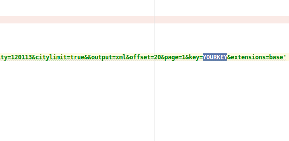

# MapScrapy

## Referrence

* [基于python和amap（高德地图）web api的爬虫，用于搜索某POI点](http://www.fx114.net/qa-205-149112.aspx)
* [如何使用网络爬虫抓取海量地址的 GPS 地理信息](https://www.zhihu.com/question/39801233)


## CrawlFactoryInfoDemo

1. [注册高的地图用户，申请key](http://lbs.amap.com/api/webservice/reference/search/#t5)
2. 将代码中的key换成step1申请的key：



3. 运行Demo
```
python ./CrawlFactoryInfoDemo.py
```

